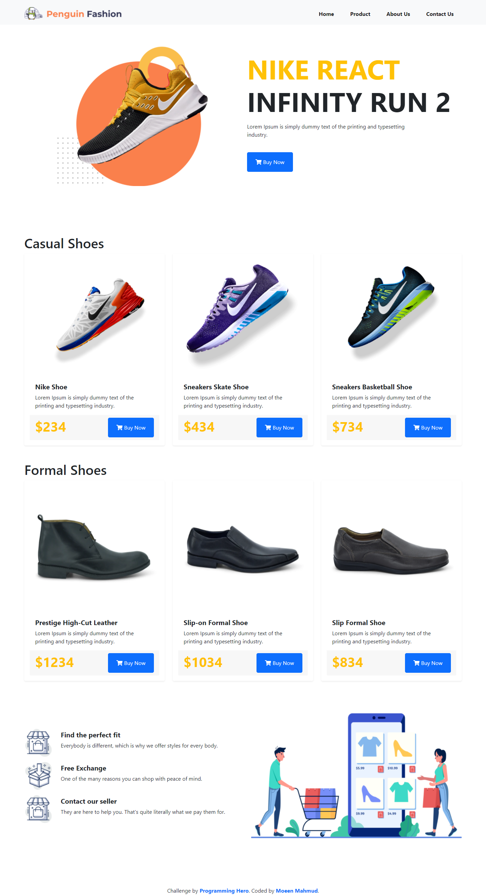

# Programming Hero - Nike React Landing Page Solution

This is a solution to the [Nike React Challenge on Programming Hero](https://github.com/ProgrammingHero1/nike-react). Programming Hero is a great frontend web development bootcamp for those who have the passion for learning and coding. It helps you improve your coding skills by buiding realistic projects.

## Table of contents

- [Overview](#overview)
  - [The challenge](#the-challenge)
  - [Screenshot](#screenshot)
  - [Links](#links)
- [My process](#my-process)
  - [Built with](#built-with)
  - [What I learned](#what-i-learned)
  - [Continued development](#continued-development)
  - [Useful resources](#useful-resources)
- [Author](#author)

## Overview

### The challenge

Users should be able to view the optimal layout depending on their device's screen size.

### Screenshot

### Links

- Solution URL: [Git Repo](https://github.com/moeen-mahmud/nike-react)
- Live Site URL: [Live Site](https://moeen-nike-react-ph.netlify.app/)

## My Process

### Built With

- HTML5 markup
- Bootstrap CSS
- Mobile-first workflow

### What I learned

This is a follow-up challenge of the previous [Penguin Fashion Landing Page](https://penguin-fashion.vercel.app/). But for this challenge I use [Bootstrap](https://getbootstrap.com/). In this project, I learn how to use column order for multiple device view as well how to optimize text align for mobile-first workflow.

### Continued Development

Though I love to use [Tailwind CSS](https://tailwindcss.com/), but [Bootstrap](https://getbootstrap.com/) has some pre-built component such as navbar, carousel etc. For this reason, it is easier to rapid coding a site with **Bootstrap**.

### Useful resources

- [Bootstrap Documentation](https://getbootstrap.com/docs/5.0/getting-started/introduction/)
- [Mozilla Developer Network](https://developer.mozilla.org/en-US/)

## Author

- Facebook - [moeen.mahmud](https://www.facebook.com/moeen.mahmud)
- Twitter - [moeen_mahmud](https://twitter.com/moeen_mahmud)
